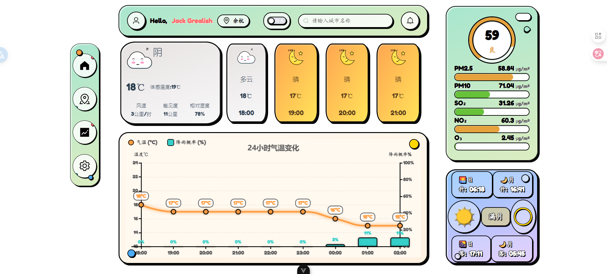

# 1.该系统是通过vue3架构+element-Puls组件+UIverse天气卡片设计+dribbble网页设计参考实现的天气系统网页
## 旨在做到以下内容:
## 首页

## 项目演示视频

<video controls width="640">
  <source src="https://github.com/umore-f/weather-forecast/blob/main/src/assets/video/%E5%A4%A9%E6%B0%94%E9%A1%B9%E7%9B%AEv%201.0%20-%20Google%20Chrome%202025-11-05%2018-10-49.mp4" type="video/mp4">
  您的浏览器不支持 HTML5 视频标签。
</video>

## 已实现的内容v_1.0:
1.城市搜索 - 支持搜索全球城市
2.实时天气信息
3.温度、体感温度
4.天气状况（晴、雨、雪等）+ 动态图标
5.湿度、风速、气压
6.日出/日落时间
7.多日预报 - 未来5-7天天气预报
8.24小时预报 - 当天逐小时天气变化
9.天气背景动态效果 - 根据天气自动切换背景
10.空气质量指数 - AQI显示

## 2.0增强用户体验功能(建设中):
搜索与地点管理：

全球地点搜索：支持城市名、邮编、甚至地标搜索。

多地点管理：允许用户保存多个关注的城市/地点，方便快速切换（例如：家庭地址、工作地址、家乡、旅行目的地）。

直观的数据可视化：

温度曲线图：在逐小时和多日预报中，用曲线图展示温度变化趋势。

降水概率图表：用条形图清晰展示未来24小时内何时可能下雨。

风向风速可视化：使用风向标或流动的动画来展示风向和风力。

雷达图与卫星云图：让用户直观地看到降雨带、云层的移动轨迹，了解天气系统的动态。

个性化与情境化建议：

穿衣指数：根据温度建议穿着，如短袖、薄外套、羽绒服等。

紫外线指数：提醒是否需要防晒。

运动指数：判断是否适合进行户外运动。

洗车指数：根据未来降雨概率给出建议。

钓鱼/航海指数：结合气压、风速等给出专业建议。

恶劣天气预警：

突出显示：对暴雨、台风、暴雪、雷电、大风等极端天气，用醒目的颜色（如红色、橙色）进行强提醒。

推送通知：如果支持PWA，可以在恶劣天气来临时推送浏览器通知。

详细预警说明：包括预警类型、级别、影响区域和防范指南。

响应式设计：

必须在桌面电脑、平板和手机等不同尺寸的屏幕上都能完美显示和操作。

## v_3.0 高级与特色功能(未来计划)

这些功能能让你的天气网页在众多竞争对手中显得与众不同。

历史天气数据：提供过去某一天或某一时期的天气历史，对于旅行回顾、活动复盘或数据分析很有用。

日出/日落与月相：

精确的日出/日落时间：对摄影爱好者、户外活动者非常重要。

黄金时刻/蓝色时刻：为摄影师提供专业的拍摄时间。

月相和月出/月落时间。

数据来源与精度：

透明化数据来源：告知用户数据来自哪个权威机构（如中国气象局、AccuWeather、METAR等），增加可信度。

高精度预报：提供公里级甚至米级的高精度天气预报，特别是在山区、沿海等复杂地形区域。

可定制的仪表盘：

允许用户自己选择在主页上显示哪些信息模块（如湿度、气压、紫外线），隐藏不关心的信息。

分享功能：

生成一张美观的天气卡片，方便用户分享到社交媒体或发送给朋友。

PWA（渐进式Web应用）支持：

用户可以像安装App一样将网页“添加至主屏幕”，获得类似原生应用的体验，并支持离线查看基本信息和推送通知。

国际化与无障碍访问：

多语言支持。

单位切换：摄氏度/华氏度，公里/小时、英里/小时，毫米/英寸等。

无障碍设计：为视障用户提供屏幕阅读器支持，确保足够的颜色对比度。

